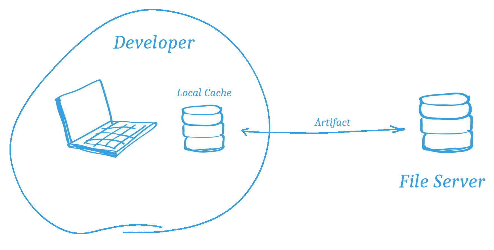
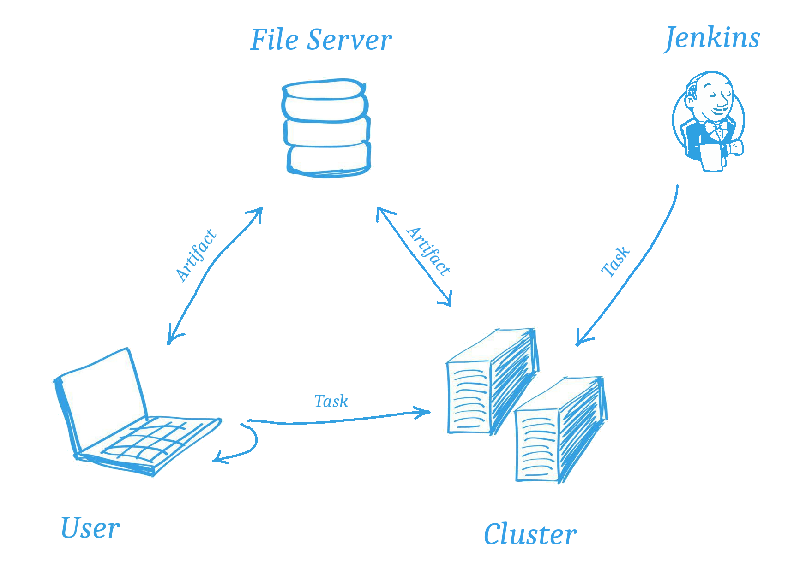
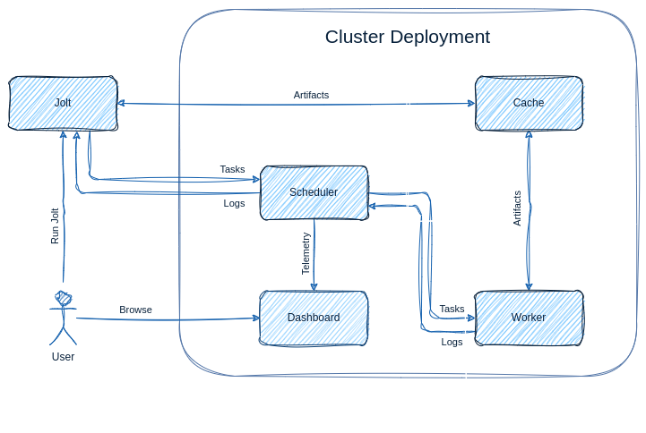
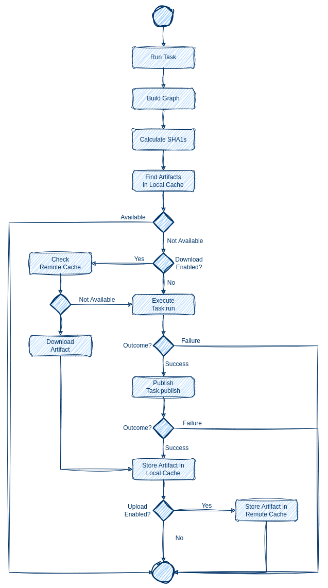
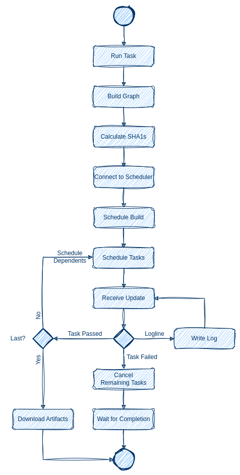

Architecture
============

.. architecture-alias-start

Overview
--------

Jolt is a versatile tool for executing user-defined tasks written in
Python. It offers the flexibility to run tasks either locally on a
user's computer or remotely on a cluster of workers. The tool is
designed to be extensible and can handle tasks of any kind, making it
particularly suitable for time-consuming and parallelizable tasks.

Tasks in Jolt are implemented as Python classes. For example, the
following code defines a simple "Hello" task:

    .. code-block:: python

        from jolt import Task

        class Hello(Task):
                def run(self, deps, tools):
                        print("Hello world!")

When a task is executed, it generates an artifact containing files and
metadata. All task artifacts are stored in a local cache directory and
have a unique and reproducible identity, determined by a SHA1 sum of
various task attributes. This identity ensures consistent exchange of
artifacts between local and remote caches.

In a typical configuration, automation software like Jenkins triggers
task execution on a cluster of workers. The resulting artifacts are
stored in the file server, ready to be downloaded by other users
attempting to execute the same tasks, thereby optimizing time and
resources.

Components
----------

A full deployment of the Jolt system consists of the following components:

  - The Jolt user application, which is the command line tool that executes tasks and
    optionally delegates tasks to a build cluster.

  - The Jolt scheduler, which is responsible for distributing tasks from
  - clients to workers and relaying the results back.

  - The Jolt worker, which is responsible for executing tasks as instructed by
    the scheduler.

  - The Jolt cache, which is an HTTP-based file server used for sharing
    artifacts between clients and workers in a build cluster.

  - The Jolt dashboard, which is a web application where users can monitor a
    build cluster in real time.

Jolt
~~~~

The Jolt user application is a command line tool written in Python.

The application has several subcommands, such as:

    - :ref:`build <reference-cli-build>` -
      to execute a task, either locally or remotely on a cluster of workers.

    - :ref:`clean <reference-cli-clean>` -
      to remove artifacts from the local cache.

    - :ref:`display <reference-cli-display>` -
      to display the dependency graph of a task.

    - :ref:`inspect <reference-cli-inspect>` -
      to display information about a task, its parameters, etc.

    - :ref:`list <reference-cli-list>` -
      to list available tasks.

    - :ref:`log <reference-cli-log>` -
      to display the Jolt log.

    - :ref:`report <reference-cli-report>` -
      to report an issue to system administrators.

Cache
~~~~~

The Jolt cache service is an HTTP-based file server used for sharing
task artifacts between users and/or workers in a build cluster.

When the configured maximum size of the cache is exceeded, the service
starts evicting artifacts in the order of least recently used
(LRU). Additionally, the cache can be configured with an expiration
time, allowing eviction of artifacts only after a certain period of
time has passed since their last access.

Other cache service implementations, such as plain HTTP/WebDav
servers, are supported or possible to support.

Scheduler
~~~~~~~~~

The scheduler is a crucial component in a
clustered Jolt system. It facilitates the execution of tasks by
relaying requests from clients to workers and providing status updates
in return.

When initiating a build, clients submit a build scheduling request to
the scheduler. This request includes detailed information about the
build environment, such as the desired Jolt client version, the task
dependency tree with pre-calculated SHA1 sums, and any parameter
values or Git repository changes.

Once the scheduler accepts the build request, clients can proceed to
request the execution of individual tasks within the build. Each task
may have specific platform requirements, which are matched against the
platform properties advertised by workers. If a worker meets all the
requirements, it becomes eligible to execute the task.

When a worker becomes available and needs to select a build to
execute, the scheduler filters out tasks that do not meet the worker's
requirements. It then prioritizes the remaining builds based on their
priority level. Tasks from higher-priority builds are scheduled before
tasks from lower-priority builds. Builds with the same priority are
scheduled in a first-in, first-out (FIFO) order. Once a build is
selected for a worker, it remains allocated to that worker until all
tasks in its queue are completed.

During task execution, the worker sends real-time log output back to
the scheduler, which then relays it back to the client. Clients have
the option to mute log lines by using the `-m/--mute` flag during the
build request. In this case, only the logs of failed tasks are
displayed. The scheduler stores the logs in a FIFO cache with a
configurable size, allowing them to be accessed for a certain period
of time after a task finishes. Clients can download the logs through
the HTTP `/logs/<id>` endpoint.

If configured, the scheduler can forward task telemetry to the Jolt
Dashboard web service. This enables users to monitor the status and
logs of all tasks in the system. The Dashboard fetches the logs
using the scheduler's HTTP REST API.

Clients have the ability to cancel a build. Tasks that have not
started yet are immediately cancelled. For running tasks, the
scheduler sends an interrupt signal to the workers allocated to the
build. Depending on the state of the running tasks, they may be
interrupted immediately or allowed to continue executing to ensure
proper release of acquired resources. This behavior is similar to
pressing Ctrl-C during a local build.

Worker
~~~~~~
The worker is responsible for executing tasks as
instructed by the scheduler. It is designed to be deployed as a
container on a node in the build cluster.

Workers can be added or removed at any time. If a worker is added, the
scheduler will detect this and automatically schedule tasks to it. If
a worker is removed, the scheduler will reschedule the tasks that were
running on it. Both scenarios are transparent to users running builds.

Each worker has a set of platform properties that can be used to
select which tasks should be executed on it. For example, a worker may
have a property `node.os` with the value `linux` and another worker
may have the same property with the value `windows`. A task can be
configured to only run on workers with a specific property value.

When requested to execute a task from a build, the worker first
installs the same version of the Jolt client that issued the request
and then runs the ``executor`` subcommand, prepares the execution
environment and connects to the scheduler to receive task execution
requests for the active build request.

Tasks are executed until the the build request task queue is depleted.
During execution, the executor automatically downloads dependency
artifacts from the cache service, ensuring that they are available to
the executed task before execution starts. Throughout the execution
process, the executor sends regular status updates and log output to
the scheduler, which then relays them back to the request maker.

Task artifacts are uploaded to the cache service after successful
execution so that they can be accessed by other workers and the
client.

After depleting the task queue, the executor exits and becomes
available for another build request.

Multiple workers can subscribe to tasks from the same build and run
them in parallel. When workers are located on the same server and
share a local cache, only one worker needs to download dependencies,
reducing network bandwidth usage.

Diagrams
--------

Local Execution
~~~~~~~~~~~~~~~

The diagram below illustrates what happens in the Jolt application when tasks are executed locally by a user.

Remote Execution
~~~~~~~~~~~~~~~~

The diagram below illustrates what happens in the Jolt application when a user executes tasks in a build cluster.

.. architecture-end
