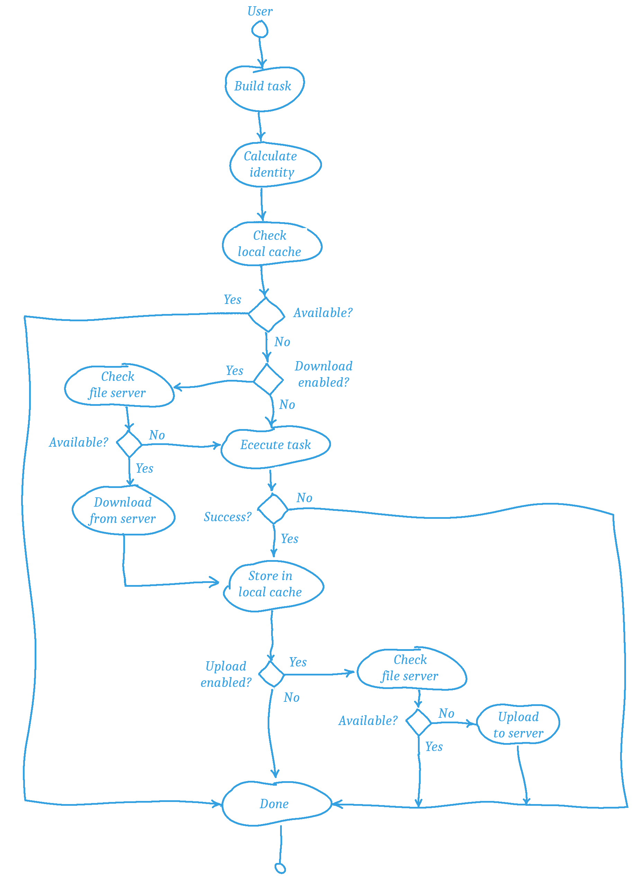

Architecture
============

.. architecture-alias-start

Overview
--------

Jolt is a tool executing user-defined tasks. Execution is carried out
either locally on a user's computer or remotely on clustered workers.
Different types of cluster infrastructures are supported through plugins.

When a task is executed an artifact containing files and metadata is created.
The artifact is shared among users and workers in the network by the means of
storage providers (file servers). Again, different types are supported
through plugins.

In a typical configuration, automation software such as Jenkins may trigger
tasks to be executed on a cluster of workers. Resulting artifacts are stored
on the file server, ready to be downloaded by users attempting to execute
the same tasks.

.. image:: img/overview.png

Artifact Cache
--------------

All task artifacts are stored in a local cache directory.
They are content addressable, meaning they all have a unique and
reproducible identity. This identity allows the artifacts to be
consistently exchanged between local and remote caches.

.. image:: img/caches.png

The identity is a SHA1 sum of different attributes that may influence the
output of the task, as illustrated below. Such influence includes the
source code of the task, task parameters and their assigned
values, the content of files and scm repositories, the identity of
dependency tasks, etc.

The SHA1 digest is used as a key when looking up artifacts both
locally and remotely.

Execution
---------

The diagram below illustrates what happens when a task is executed by
a user.

.. architecture-end

Remote execution
----------------

Tasks can be distributed and executed remotely with the help of a
scheduler service and a set of workers. The scheduler is responsible
for prioritizing and distributing tasks to workers and collecting
the results. Workers install and run the Jolt client that initiated
a build and execute tasks as instructed by the scheduler.

Workers can be added or removed at any time. If a worker is added,
the scheduler will detect this and automatically schedule
tasks to it. If a worker is removed, the scheduler will reschedule
the tasks that were running on it. Both scenarios are transparent
to users running builds.

Each worker has a set of platform properties that can be used to
select which tasks should be executed on it. For example, a worker
may have a property `node.os` with the value `linux` and another
worker may have the same property with the value `windows`. A task
can be configured to only run on workers with a specific property value.

When a user starts a build, the client first check if the task
has already been executed. If so, the artifact is downloaded and
the build is finished. If not, the client sends a description
of the build and its tasks to the scheduler. Once the build is
registered, the client starts requesting execution of the tasks
in the build in topological order. The scheduler selects a worker
that matches a task's platform requirements and sends the task to it.

When requested to execute a task from a build, the worker first
installs the client and starts an executor that connects to the
scheduler to receive the task. The executor then runs the task and
sends updates to the client (through the scheduler) in the form
of logs and status messages. When the task is finished, the
executor will upload the artifact to the cache and the client
downloads it. The executor remains running as long as the worker
is assigned to the build and there are tasks in the queue
to be executed.

Since the client is installed on the worker, it is possible to
execute tasks that depend on other tasks that are not part of
the build. The client will automatically download the artifacts
of the dependencies and make them available to the tasks.

Deployment of the scheduler and workers can be done in different
ways, but typically they are deployed as Docker containers in
a Kubernetes cluster. See the user-guide for more information.

