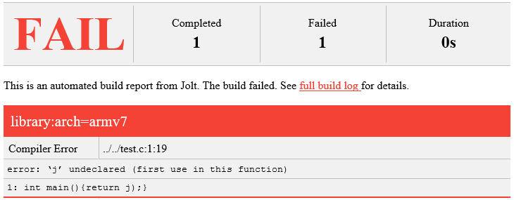

Configuration
==============

By default, Jolt loads its configuration from ``$HOME/.config/jolt/config``.
It uses this format:

.. code-block:: text

    [section]
    key = value

The configuration can be edited manually using any editor, but
the recommended way to change configuration is to use the Jolt
``config`` command. For example:

.. code-block:: bash

    $ jolt config jolt.cachesize 100G

Available sections and their respective keys are detailed below.

Jolt
------

The ``[jolt]`` config section contains global configuration.

* ``cachesize = <size>``

  Maximum size of the local artifact cache. When this size is reached, Jolt
  will start to evict artifacts from the cache until it no longer exceeds the
  configured limit. Artifacts which are required to execute a task currently
  present in the dependency tree are never evicted. Therefore, it may not be
  possible for Jolt to evict enough artifacts to reach the limit. Consider
  this size advisory. The size is specified in bytes and SI suffixes such as
  K, M and G are supported. Example: ``cachesize = 5G``. The default size is
  1G.

* ``colors = <boolean>``

  Colorize output. When enabled, Jolt uses colors to make it easier to
  read the console log and to spot errors. The default is ``true``.

* ``default = <task>``

  When invoked without any arguments, Jolt by default tries to build a
  task called ``default``. The name of the default task can be overridden
  by setting this configuration key.

* ``download = <boolean>``

  Configures if Jolt is allowed to download artifacts from remote storage
  providers or not when building locally. The option has no effect on
  distributed network builds. The default value is ``true``.

* ``log = <filepath>``

  Location of Jolt's logfile. By default, the logfile is written in
  ``$HOME/.jolt/jolt.log``.

* ``upload = <boolean>``

  Configures if Jolt is allowed to upload artifacts to remote storage
  providers or not when building locally. The option has no effect on
  distributed network builds. The default value is ``true``.

* ``pager = <str>``

  The pager to use, e.g. when viewing the logfile. Defaults to
  the PAGER environment variable followed by less, more and cat,
  in that order.

* ``pluginpath = <str>``

  A list of one or more directory names, separated by colon, specifying
  additional search paths for plugins.

* ``shell = <str>``

  The shell to use when entering the interactive task debug shell.

* ``threads = <integer>``
  Used to limit the number of threads used by third party tools such as Ninja.
  The environment variable ``JOLT_THREADS`` can also be used.
  The default value is the number of CPUs available.

* ``parallel_tasks = <integer>``
  Used to control the number of tasks allowed to execute in parallel on the
  local machine. The environment variable ``JOLT_PARALLEL_TASKS`` can also
  be used as well as the ``-j/--jobs`` build command option.
  The default value is 1.

Network
--------

The ``[network]`` section contains keys applicable when Jolt is started
in network execution mode.

* ``config = <text>``

  The ``config`` key contains config file content for Jolt to be used
  when Jolt is executed on a different machine during distributed
  execution. The configuration is automatically passed to the remote
  worker and may contain all subsections and keys detailed in this
  document. Lines must be properly indented for the key to be
  considered multiline. Example:

  .. code-block:: text

    [network]
    config = [jolt]
             upload = true
             download = true

Plugins
-------

Jolt can be extended through plugins. Those already built-in and their
configuration options are described below.

Alias
^^^^^

This plugin can be used to create user-defined task aliases
through configuration keys. An alias points to one or many
other tasks. For example, to create an alias called ``deploy``
which deploys a fictitious smartphone app to all supported devices,
run:

.. code-block:: bash

    $ jolt config alias.deploy "deploy/android deploy/iphone"
    $ jolt build deploy

Alternatively, edit the configuration manually:

.. code-block:: bash

    [alias]
    deploy = deploy/android deploy/iphone

Aliases cannot be used to override the names of tasks loaded from recipes.

Allure
^^^^^^
This plugin generates an Allure test report on the outcome of executed
tasks. The report includes:

 - status of tasks, i.e. successful, failed or skipped
 - duration of tasks
 - hostname of executor
 - logs

The plugin is enabled by adding a ``[allure]`` section in
the Jolt configuration. Its dependencies must also be
installed separately:

.. code-block:: bash

  $ pip install jolt[allure]

Available configuration keys:

* ``loglevel`` - The level of detail to include in task logs:
  ``INFO``, ``VERBOSE`` or ``DEBUG``
* ``path`` - Path to directory where result files are written.
  Default: ``<workspace>/allure-results``.

AMQP
^^^^

The AMQP plugin implements distributed task execution with the help
of an AMQP message queue broker such as RabbitMQ. When the plugin is used,
tasks execution requests are submitted to an AMQP queue. Execution requests
are then consumed by workers that run tasks and build artifacts.

The plugin enables a special subcommand ``amqp-worker`` that is used
to run a worker. It is recommended to deploy multiple workers as well as
a message queue broker using an orchestrator such as Kubernetes.

As long as a connection to the message queue broker can be maintained,
the number of workers may be scaled up and down transparently without
affecting tasks already in progress. Workers may even be redeployed
completely. If a worker is stopped before completing a task, the task
is restarted as soon as another worker becomes available. Note, however,
that tasks can't be safely interrupted if they have side-effects outside
of the worker.

To use this plugin, a networked artifact storage provider must also be
configured to enable the workers to share artifacts between each other.

The plugin is enabled by adding a ``[amqp]`` section in
the Jolt configuration. Its dependencies must also be
installed separately:

.. code-block:: bash

  $ pip install jolt[amqp]

These configuration keys exist:

* ``host`` - Hostname or address of the AMQP service. Default: amqp-service

* ``port`` - Port number of the AMQP service. Default: 5672

* ``max-priority`` -
  Optional worker configuration. Enables task priority queues. Tasks
  that are waiting in queue for a worker will be dequeued in order of
  priority. See ``priority``.
  This value configures the number of priority levels that will be
  available and should be a positive integer between 1 and 255.
  Values between 1 and 10 are recommended. Default: 1.

* ``priority`` -
  Optional client configuration. Configures the default priority of
  all tasks submitted to the queue. Default: 0.

* ``routing_key`` -
  Optional. By using routing keys, tasks can be directed to different
  types of workers. When starting a worker by using the ``amqp-worker``
  command, the worker will only consume tasks tagged with the configured key.
  To tag a task, set the ``routing_key`` task attribute. Default: default

* ``workers`` -
  Optional client configuration. The maximum number of tasks Jolt is
  allowed to run in parallel. Default: 16.

* ``keyring.username`` -
  Username to use when authenticating with the AMQP service.

* ``keyring.password`` -
  Password to use when authenticating with AMQP service. Should normally
  never need to be set in the configuration file. By default, Jolt asks
  for the password when needed and stores it in a keyring for future use.

* ``keyring.service`` -
  Keyring service identifier. Defaults to ``amqp``.

HTTP
^^^^

The HTTP plugin implements an artifact storage provider. When used,
artifacts can be automatically uploaded to and downloaded from a configured
HTTP server when tasks are executed.

This is useful in many situations, for example:

- To support distributed task execution. Task executors must be
  able to share artifacts between each other. Using a networked storage
  provider is an easy way to meet that requirement.

- To reduce execution time by letting multiple users share the same artifact
  cache. If one user has already executed a task, its artifact is simply
  downloaded to others who attempt execution.

- To reduce the amount of disk space required locally. Jolt can be configured
  to evict artifacts more aggressively from the local cache. Artifacts will
  still be available on the server if needed.

The HTTP plugin is enabled by adding an ``[http]`` section in
the Jolt configuration.

These configuration keys exist:

* ``download`` -
  Boolean. Allow/disallow artifacts to be downloaded from the HTTP server.
  Defaults to ``true``.

* ``upload`` -
  Boolean. Allow/disallow artifacts to be uploaded to the HTTP server.
  Defaults to ``true``.

* ``uri`` -
  URL to the HTTP server.

* ``keyring.service`` -
  Keyring service identifier. Currently, only basic authentication is
  supported. Authentication is disabled if left unset.

* ``keyring.username`` -
  Username to use when authenticating with the HTTP server.

* ``keyring.password`` -
  Password to use when authenticating with the HTTP server. Should normally
  never need to be set in the configuration file. By default, Jolt asks
  for the password when needed and stores it in a keyring for future use.

Autoweight
^^^^^^^^^^

The autoweight plugin automatically collects statistics about task execution times.
The data is used to assign weights to task, allowing the Jolt scheduler to favor tasks
along the critical path. This improves overall execution time in a distributed execution
configuration where many tasks are executed in parallel.

The plugin is enabled by adding an ``[autoweight]`` section in
the Jolt configuration.

These configuration keys exist:

* ``samples`` - Integer. The number of execution time samples to store per task in the database. Once the number is exceeded, samples are evicted in FIFO order.

Dashboard
^^^^^^^^^

The dashboard plugin automatically submits required telemetry to
the Jolt Dashboard. It should be enabled on both clients and workers.

The plugin is enabled by adding a ``[dashboard]`` section in
the Jolt configuration.

These configuration keys exist:

* ``uri`` - Base URI of the Jolt Dashboard. Default: http://dashboard

Email
^^^^^

The email plugin sends an HTML email report to configured recipients
when builds have completed. The email includes a list of interpreted
errors in case of failure.

The plugin is enabled by adding a ``[email]`` section in
the Jolt configuration.

These configuration keys exist:

* ``server`` - SMTP server used to send emails.
* ``from`` - Sender email address.
* ``to`` - Receiver email address. May also be read from environment, e.g.
  ``{ENV|GERRIT_PATCHSET_UPLOADER_EMAIL}``. Multiple addresses should be
  separated by a single space.
* ``cc`` - Copy recipients.
* ``stylesheet`` - An optional custom XSLT stylesheet used to transform the
  Jolt result manifest into an HTML email.
* ``on_success`` - Send emails when builds are successful. Default: ``true``
* ``on_failure`` - Send emails when builds failed. Default: ``true``

FTP
^^^

The FTP plugin implements an artifact storage provider. When used,
artifacts can be automatically uploaded to and downloaded from a configured
FTP server when tasks are executed.

The plugin is enabled by adding an ``[ftp]`` section in
the Jolt configuration.

These configuration keys exist:

* ``download`` -
  Boolean. Allow/disallow artifacts to be downloaded from the FTP server.
  Defaults to ``true``.

* ``host`` -
  Hostname/IP address of the FTP server.

* ``path`` -
  Path to directory where artifacts should be stored on the FTP server.
  Defaults to ``jolt``. The directory is created if it doesn't exist.

* ``tls`` -
  Use a TLS connection to the FTP server.

* ``upload`` -
  Boolean. Allow/disallow artifacts to be uploaded to the FTP server.
  Defaults to ``true``.

* ``keyring.username`` -
  Username to use when authenticating with the FTP server.

* ``keyring.password`` -
  Password to use when authenticating with the FTP server. Should normally
  never need to be set in the configuration file. By default, Jolt asks
  for the password when needed and stores it in a keyring for future use.

* ``keyring.service`` -
  Keyring service identifier. Defaults to ``ftp``.

Logstash (HTTP)
^^^^^^^^^^^^^^^

The logstash plugin is used to collect task logs into a common place. This is useful
in distributed execution environments where detailed logs may not always be immediately
accessible to ordinary users. Unlike the terminal log output, stashed logs are always
unfiltered and include statements from all log levels as well as exception callstacks.

The plugin is enabled by adding a ``[logstash]`` section in
the Jolt configuration.

These configuration keys exist:

- ``http.uri`` - An HTTP URL where logs will be stashed. The HTTP PUT method is used.
- ``failed`` - Boolean. Stash logs when tasks fail.
- ``finished`` - Boolean. Stash logs when tasks finish successfully.

Ninja Compilation Database
^^^^^^^^^^^^^^^^^^^^^^^^^^

This plugin enables compilation database generation for Ninja C++
tasks. The database is automatically published in task artifacts.
Note that commands are recorded exactly as invoked by Ninja and
they are therefore not immediately usable because of how Jolt
sandboxes dependencies. A special command, ``compdb`` is made
available to post-process published databases into a database that
is usable with IDEs. The command takes an already built task as
argument:

.. code-block:: bash

    $ jolt compdb <task>

Upon completion, a path to the resulting database is printed.
The database aggregates the databases of the task and all its
dependencies.

The plugin is enabled by adding a ``[ninja-compdb]`` section in
the Jolt configuration. Ninja version >= 1.10.0 is required.

Ninja Compilation Cache
^^^^^^^^^^^^^^^^^^^^^^^

This plugin enables a compilation cache allowing C/C++ object files
to be reused from libraries residing in the artifact cache. Reuse
is permitted if the source file, included headers and the compiler
command line are unmodified since the object was built.

The plugin is enabled by adding a ``[ninja-cache]`` section in
the Jolt configuration.

Selfdeploy
^^^^^^^^^^

The Selfdeploy plugin automatically deploys the running version
of Jolt to all workers in a distrubuted execution environment.
This is useful to ensure that the same version of Jolt and its
dependencies are used everywhere when tasks are executed.

Before starting execution of a task, a network executor will
download Jolt from the configured storage provider and install
it into a virtual environment. Multiple versions can co-exist
on workers, thus avoiding manual deployment of multiple
container images in clusters.

The plugin is enabled by adding a ``[selfdeploy]`` section in
the Jolt configuration. Note that ``pip`` must be installed.

These configuration keys exist:

* ``extra`` -
  Comma separated list of paths to additional python modules to be
  deployed. The paths should be relative to the workspace root.

Once enabled, the plugin automatically passes two parameters to
distributed network builds:

- ``jolt_url`` -
  A URL to a compressed tarball with the sources of the running Jolt
  version.

- ``jolt_identity`` -
  The identity of the Jolt artifact.

- ``jolt_requires`` -
  A list of additional Python modules to install on the executor.

Symlinks
^^^^^^^^

The symlink plugin automatically creates symlinks to task artifacts
in the jolt workspace (relative to the topmost ``.jolt`` file). The
symlinks are kept updated and always points to the latest built
artifact.

The plugin is enabled by adding a ``[symlinks]`` section in
the Jolt configuration.

These configuration keys exist:

* ``path`` - Path, relative to the workspace root, where symlinks
  will be created. Defaults to ``artifacts``.

Telemetry
^^^^^^^^^

The telemtry plugin posts task telemetry to a configured HTTP
endpoint. The payload is a JSON object with these fields:

* ``name`` - The name of the task.
* ``identity`` - The identity of the task artifact.
* ``instance`` - A UUID representing the lifecycle of the task.
  Tasks can be executed multiple times with the same identity,
  for example if the first execution attempt failed and a subsequent
  attempt succeeded. The instance ID may be used to distingush between
  such attempts.
* ``hostname`` - hostname of the machine from which the telemetry
  record originated.
* ``role`` - ``client`` or ``worker`` depending on where the record
  originated.
* ``event`` - ``queued``, ``started``, ``failed`` or ``finished``.

The plugin is enabled by adding a ``[telemetry]`` section in
the Jolt configuration.

These configuration keys exist:

* ``uri`` - Where telemetry records should be posted.
* ``local`` - Submit telemetry for locally executed tasks. Default: ``true``.
* ``network`` - Submit telemetry for tasks executed by a network worker. Default: ``true``.
* ``queued`` - Enable queued event. Default: ``true``.
* ``started`` - Enable started event. Default: ``true``.
* ``failed`` - Enable failed event. Default: ``true``.
* ``finished`` - Enable finished event. Default: ``true``.
